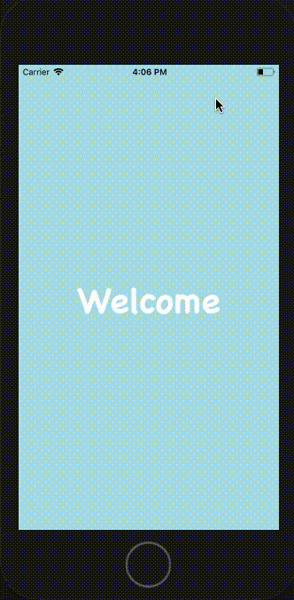

# Part 13
## Changelog
For this part on making the ChatList tab, we want to display our friends' names and their profile picture. Furthermore, we would like to grab the msg_uid so upon clicking the item, the App knows which message log to grab from firebase. Lastly, we would also like to grab our friends' uid which when combined with our own uid, will allow us to differentiate who sent which messages in the message log.

To do the above, recall that our matched friends are stored in /pairings/own.uid/friend.uid with value msg_uid. This means we need our own uid, which comes from the authState's user prop. Secondly, we need to grab from the firebase.database() followed by firebase.storage(). This structure is very similar to the one used in Deck.js, both in the way data and components are loaded before displayed. 

Actions Added:
- LIST_LOADED 
- LIST_LOADING
- UPDATE_LIST

States Added:
- main2_loaded
- friend_list
- chatList_loaded

## Preview
