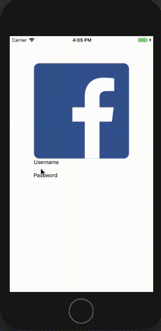

# Part 1
## Changelog
1. Added ./src folder path with actions, reducers, components folder (for later parts) and setup.js file
2. Removed App.js, replaced it with setup.js inside src
3. Created first component ‘LoginForm’ with basic components (will be replaced)
4. npm installed nachos-ui for future styling

## Preview
